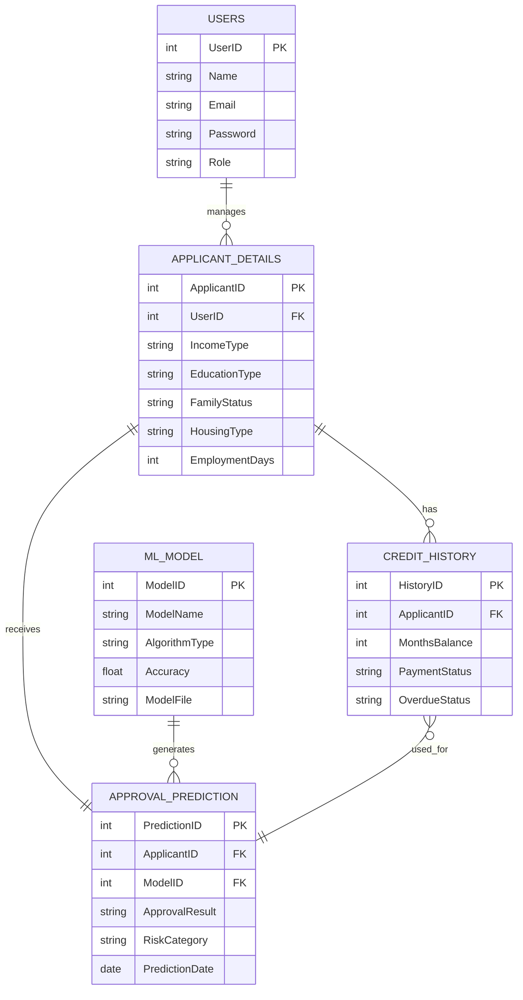

# ER Diagram - Loan Approval Prediction System

This ER diagram represents the core entities involved in the Loan Approval Prediction System. It shows how applicant information, loan-related records, credit history, machine learning model details, and approval prediction results are organized in the database.

## Entities

- `USERS`
- `APPLICANT_DETAILS`
- `CREDIT_HISTORY`
- `ML_MODEL`
- `APPROVAL_PREDICTION`

## Relationships

- One user can manage or submit multiple applicant records.
- One applicant can have multiple credit history records.
- One applicant receives one final approval prediction result.
- One machine learning model can generate multiple approval prediction results.
- Credit history information is used to generate the approval prediction.

